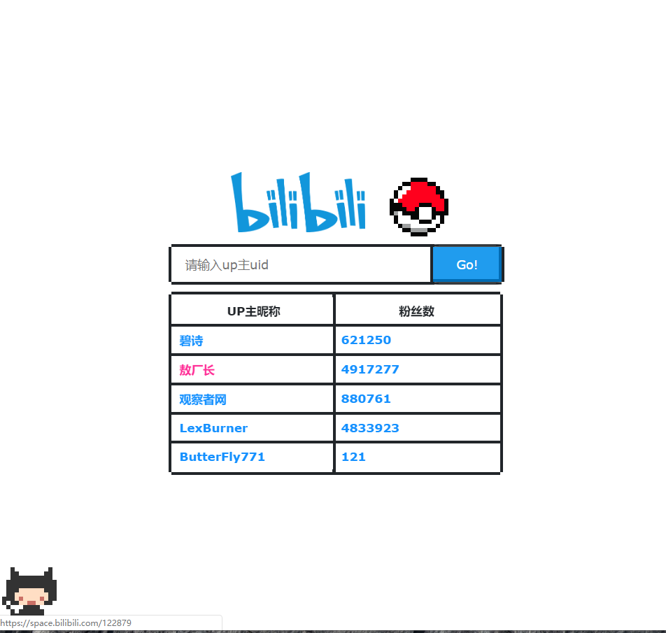

## bilibili up主粉丝查询小站

### Usage:
> npm start

打开localhost:2333 即可访问

### How works?
前端CSS UI风格使用这个: [NES.css](https://github.com/nostalgic-css/NES.css)

数字滚动效果: [Odometer](https://github.com/HubSpot/odometer)

键盘触发事件-->添加jsonp定时轮询

koa后台代理jsonp请求查询这个: [B站spider api](https://github.com/uupers/BiliSpider)

验证Etag协商缓存然后解析结果并包装到回调函数返回前端

前端响应动作添加或更新DOM